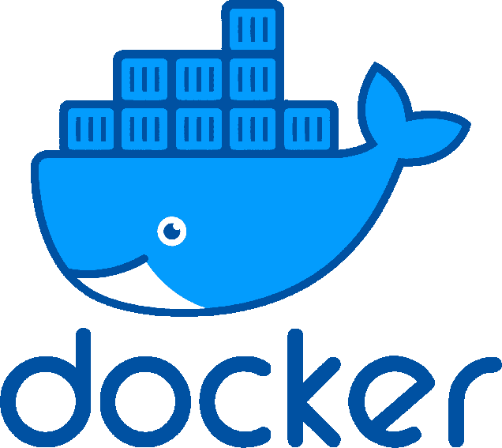
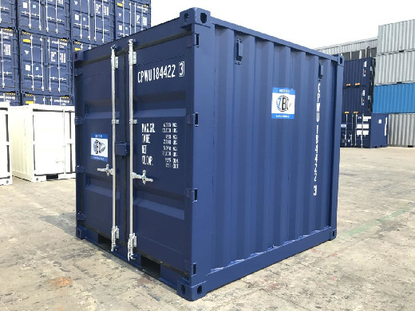
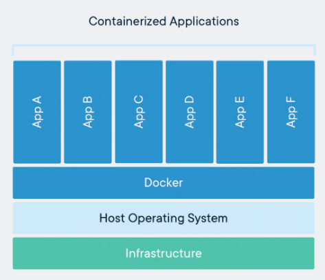

# mars_hill_docker

# Intro



# What is docker?


- What are containers

A container is a standard package of software and all of its dependencies included. They are designed to be shared and deployed anywhere. Docker containers are based on LXC (Linux containers). LCX is an operating system level virtualization method for running multiple isolated Linux systems (containers). Docker took this technology and created easy to use tools to allow anyone to create, deploy, and manage multiple containers.



- Docker image & dockerfiles

A docker images is ...... These are created using Dockerfiles.

- Docker daemon/service

The Docker daemon is a service running in the background to maintain all running docker containers. ......

- Docker CLI/GUI

There is both a CLI and GUI used for controlling the docker daemon, building docker images, and deploying docker containers.


# Installing/setting up Docker

## Windows

## Mac

## Linux

### Debian

### Ubuntu

### Fedora

### Arch

### Build from source

## Notes on root privilege

By defualt docker requires root privileges to run anything. This is because it has access to the computers ports. With this said, you may not want Docker to have root privileges.

run without root

`sudo groupadd docker`

`sudo usermod -aG docker $USER`

login in and out of shell

permission for sockets

`sudo chown root:docker /var/run/docker.sock`

`sudo chown -R root:docker /var/run/docker`

ubuntu snap for permissions

`sudo snap connect docker:home :home`

# Basic CLI commands

- version
- log
- ....

history

`docker ps -a`


# Docker GUI (how to use)

# Docker daemon/service

- start
- status
- restart
- start on boot

service name:

docker.service

snap.docker.dockerd.service

systemctl enable, start, restart, status (service)

enable - start at boot (disable to reverse)


# Dockerfile and Building an image

build & run

```FROM ubuntu:latest

CMD ["echo", "Hello, World"]```


`docker build -t echoapp .`

`docker run echoapp`

- write up example dockerfile, build it
- "build" cmd
- "run" cmd

- disable root

by defualt things are ran as root

`docker run --rm ubuntu whoami`

`docker run --rm -u 9000 ubuntu whoami`


# Deploying and managing images, containers


deploy, view and stop containers

`docker run --rm nginx`

`docker ps`

`docker kill (ID/NAME)`


set name

`docker run -d --name container_name app_name`


# Iris

Dockerfile

```FROM python:3.10


ADD requirements.txt .

RUN pip install -r requirements.txt


ADD iris.py .

CMD ["python3.10","iris.py"]```


```docker build -t irisapp .

docker run irisapp```

or

`docker build .`


`CMD ["python3.10","iris.py"]`

`RUN python3.10 iris.py`


# Docker hub


- create account
- pull
- run

docker login

docker push jarreed0/ml:tagname

docker pull jarreed0/ml:flightsmlapp


# Use cases

- ML
- SQL
- webserver
- etc

# Docker & Databricks

# Docker alternatives

# Docker/containers vs VM

# References/resources
