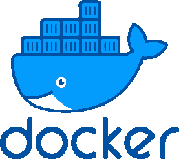

# mars_hill_docker

# Intro

# What is docker?

- What are containers
- Docker image
- Docker Dockerfile
- Docker daemon/service
- Docker CLI/GUI

# Installing/setting up Docker

## Windows

## Mac

## Linux

### Debian

### Ubuntu

### Fedora

### Arch

### Build from source

## Notes on root privilege

# Basic CLI commands

- version
- log
- ....

# Docker GUI (how to use)

# Docker daemon/service

- start
- status
- restart
- start on boot

# Dockerfile and Building an image

- write up example dockerfile, build it
- "build" cmd
- "run" cmd

# Deploying and managing images, containers

# Docker hub

- create account
- pull
- run

# Use cases

- ML
- SQL
- webserver
- etc

# Docker & Databricks

# Docker alternatives

# References/resources
